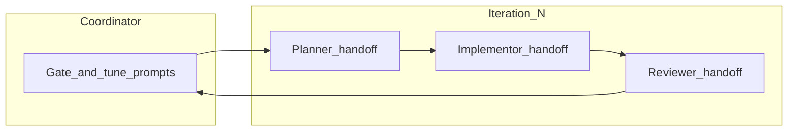

# Workflow and inter-agent contracts

Design influences: [Harness design for long-running application development](https://www.anthropic.com/engineering/harness-design-long-running-apps) — **generator vs evaluator**, **file-based handoffs**, **negotiated “done”**, **sceptical QA**, **stress-test harness components** (remove one role at a time when safe), **match harness cost to task difficulty**. Also mirror **real teams**: discovery before build, **sprints** as the unit of planning, **Git** as the unit of change.

## Phases (scale to scope)

| Phase                  | Typical owner            | Output                                                                                         |
| ---------------------- | ------------------------ | ---------------------------------------------------------------------------------------------- |
| **0 — Discovery**      | Coordinator + user       | `_working/{TOPIC}/GOALS.md` (and optionally `SPRINTS.md`) — see [discovery.md](discovery.md)   |
| **1 — Sprint shaping** | Coordinator or user      | Which sprint theme maps to **this** `iter{1…}` run; rough ordering of sprints for large work   |
| **2 — Execution loop** | Sub-agents per iteration | Tier-specific handoffs under `_working/{TOPIC}/` (Full: `.1/.2/.3`, Pair: `.2/.3`, Solo: `.2`) |

Small tasks collapse phase 0–1 into a short GOALS section at the top of `iter1.1-planner.md`. Large programmes keep GOALS stable across many iterations.

## End-to-end flow (loop)



1. **Coordinator** reads `iter{N-1}.3-reviewer.md`, **`GOALS.md`** when present, and user input; chooses **tier** (see below); spawns **Planner** with a tight prompt.
2. **Planner** writes `iter{N}.1-planner.md` only (no code).
3. **Coordinator** spawns **Implementor** with paths + “execute sprint + self-check”.
4. **Implementor** edits repo / POST / etc., writes `iter{N}.2-implementor.md`.
5. **Coordinator** spawns **Reviewer** with contract + scepticism instructions.
6. **Reviewer** writes `iter{N}.3-reviewer.md` (PASS/FAIL + steering).
7. **Coordinator** updates project index (e.g. `_working/HANDOVER-*.md` one line), decides **stop**, **iter N+1**, or **tier-down**.

## Inter-agent contracts (obligations)

| From → To                  | Deliverable                                                                                                                                                  | Acceptance                                                                                        |
| -------------------------- | ------------------------------------------------------------------------------------------------------------------------------------------------------------ | ------------------------------------------------------------------------------------------------- |
| **Coordinator → Planner**  | User goal + **`GOALS.md`** (or explicit waiver), `iter{N-1}.3-reviewer.md` excerpts (verbatim FAIL/steering), path for new `iter{N}.1-planner.md`, tier hint | Planner file exists; aligned with GOALS; references prior steering; no fragile micro-spec cascade |
| **Planner → Implementor**  | Problem statement, **3–6 outcome bullets**, **Definition of done**, **`## Sprint contract (binary checks)`** 6–12 lines, optional non-goals                  | Implementor can execute without re-deriving goals from chat                                       |
| **Implementor → Reviewer** | Changed artefacts + regenerated outputs; **`iter{N}.2-implementor.md`** with **contract self-check** table + evidence (`rg`, curl, screenshot notes)         | Reviewer can verify without reading the whole chat; gaps explicit                                 |
| **Reviewer → Coordinator** | `iter{N}.3-reviewer.md` with **contract table** PASS/FAIL per row, overall verdict, **iter N+1 steering**                                                    | Coordinator can compose next prompts without re-running verification                              |

**Non-contract:** emotional status, tool-internal errors, “looks fine to me” without mapping to a contract line — those do not satisfy obligations.

## Sprint contract rules

- Originates in the **planner** handoff under `## Sprint contract (binary checks)`.
- **Pair/Solo** tiers must reference the active contract from the latest planner handoff; do not silently replace contract lines mid-iteration.
- Each line is **binary** (PASS/FAIL) and tied to **observable evidence** (file path, tool output, metric).
- **Protocol order matters** when order changes outcomes (e.g. screenshot **before** scroll so clipping is not masked).
- **Overall PASS** iff **every** line PASS — no partial “mostly pass” for the iteration gate unless the user explicitly allows waivers as a named contract line.

## Tiering (simplify the harness)

| Tier     | Roles                            | When                                                                    |
| -------- | -------------------------------- | ----------------------------------------------------------------------- |
| **Full** | Planner → Implementor → Reviewer | Schema/queries/new panels, high regression risk                         |
| **Pair** | Implementor → Reviewer           | Prior planner contract still valid; only execution/copy/layout changed  |
| **Solo** | Implementor only                 | Mechanical change + contract fully machine-checkable; **risk accepted** |

If **Planner** would only restate the **Reviewer**, skip Planner for that iteration.

## Minimum required artefacts by tier

| Tier     | Required artefacts under `_working/{TOPIC}/`                                | Notes                                                                   |
| -------- | --------------------------------------------------------------------------- | ----------------------------------------------------------------------- |
| **Full** | `iter{N}.1-planner.md`, `iter{N}.2-implementor.md`, `iter{N}.3-reviewer.md` | New/updated contract lives in `.1`                                      |
| **Pair** | `iter{N}.2-implementor.md`, `iter{N}.3-reviewer.md`                         | `.2` and `.3` must cite the contract source file                        |
| **Solo** | `iter{N}.2-implementor.md`                                                  | Must include explicit “risk accepted” line and why Reviewer was skipped |

## Loop exit criteria (stop vs iterate)

Stop the loop when all of the following are true:

1. Every active sprint contract line is PASS (or explicitly waived by contract).
2. Latest reviewer file has no unresolved FAIL / NEEDS-EVIDENCE (Full/Pair tiers).
3. No open steering items remain for this iteration scope.
4. User acceptance condition is met (explicit approval or pre-agreed done condition).

If any item above fails, open `iter{N+1}` with copied steering and a revised prompt.

## Harness self-test matrix (quick regression checks)

Use these checks after editing the skill to ensure behaviour still matches intent:

1. **Vague multi-session request**
   - Expected: Discovery first (`GOALS.md`) before `iter1.1-planner.md`.
2. **High-risk change with unknown regressions**
   - Expected: **Full** tier with new planner contract and independent reviewer gate.
3. **Mechanical follow-up with stable contract**
   - Expected: **Pair** tier (`.2/.3`) and explicit citation of contract source file.
4. **Fully machine-checkable low-risk tweak**
   - Expected: **Solo** tier with explicit “risk accepted” note in implementor handoff.
5. **Reviewer finds one FAIL line**
   - Expected: overall FAIL, concrete steering, and forced `iter{N+1}`.
6. **All contract lines PASS**
   - Expected: loop can stop only if user acceptance condition is also met.

## Handoff filenames

All handoffs for a topic live under one directory so listing is chronological: **iteration** (`iter{N}`) then **agent order** (`.1` planner → `.2` implementor → `.3` reviewer when present by tier).

```text
_working/{TOPIC}/iter{N}.1-planner.md
_working/{TOPIC}/iter{N}.2-implementor.md
_working/{TOPIC}/iter{N}.3-reviewer.md
```

Increment **N** when Reviewer closes the loop.
