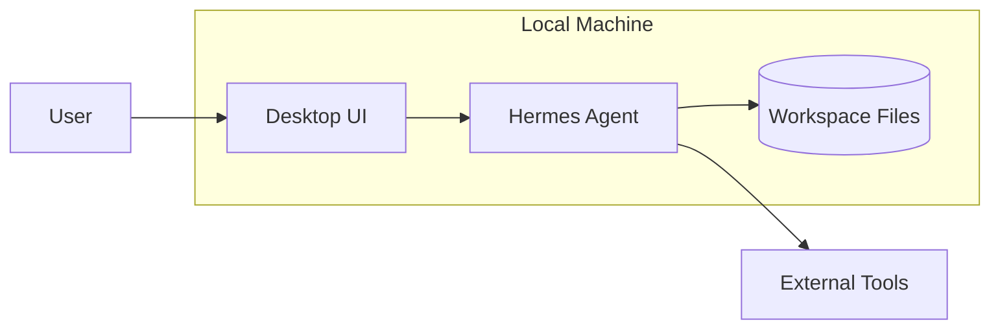
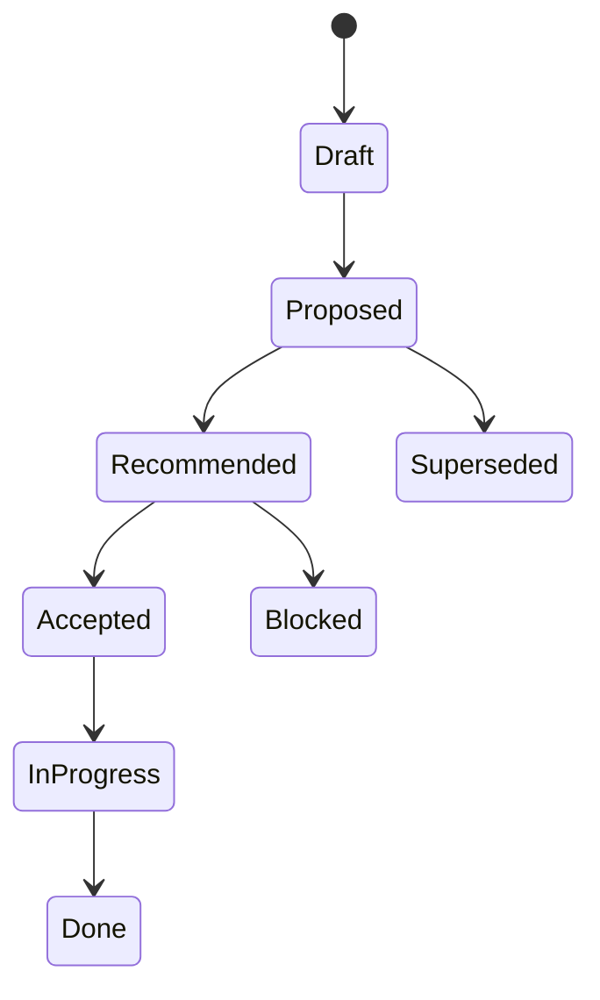
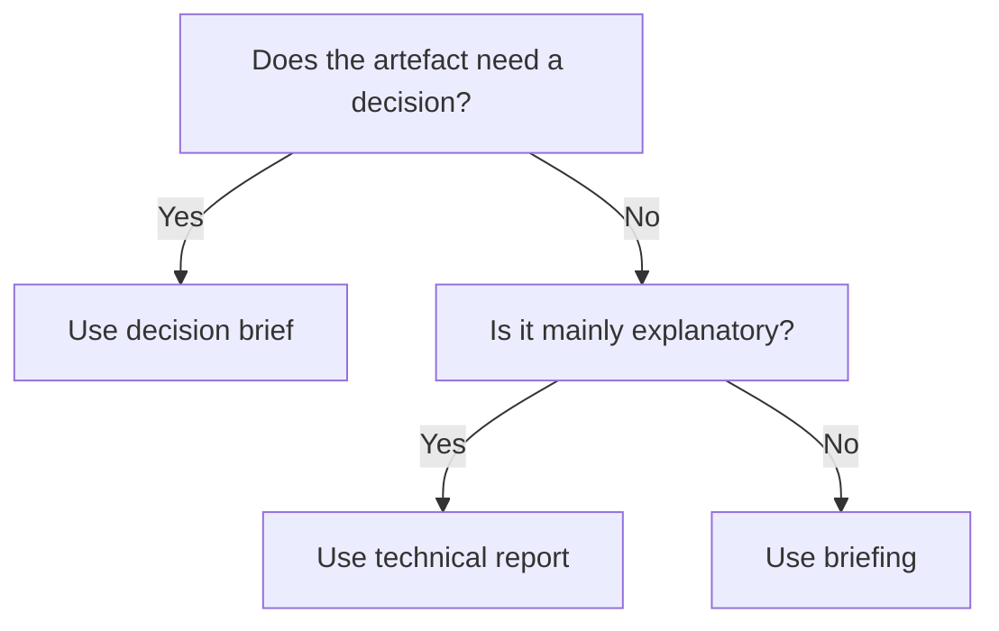

# Diagram Style

Operator Notes diagrams should show the shape of the system, not the author’s ability to decorate arrows.

## Principles

- Use labelled boxes.
- Show boundaries explicitly.
- Use directional arrows.
- Label arrows when the relationship is not obvious.
- Show ownership where it matters.
- Show state where it matters.
- Show failure paths where relevant.
- Avoid mystery icons.
- Avoid 3D/isometric decoration.
- Use colour sparingly and label the meaning.
- Ensure diagrams are readable at 100% zoom.
- Ensure diagrams export cleanly to PDF.

## Preferred diagram types

| Diagram | Use |
|---|---|
| System boundary diagram | What owns what |
| Sequence diagram | How work moves |
| State diagram | What can happen |
| Data flow diagram | Where data goes |
| Decision tree | How choices are made |
| Timeline | What happened / what changes |
| Risk map | Where failure concentrates |

## Mermaid examples

### System boundary

### State machine

### Decision tree

## Visual rules

- Prefer rectangular boxes with modest radius.
- Use solid, visible borders.
- Use text labels over icons.
- Keep the number of colours low.
- Use accent colour for the main path.
- Use warning/error colours only for risk/failure.
- Use neutral colours for supporting nodes.

## Anti-patterns

- unlabelled arrows
- tiny diagram text
- too many colours
- decorative icons
- fake infrastructure shapes that obscure the point
- diagrams that require the speaker to explain every element
